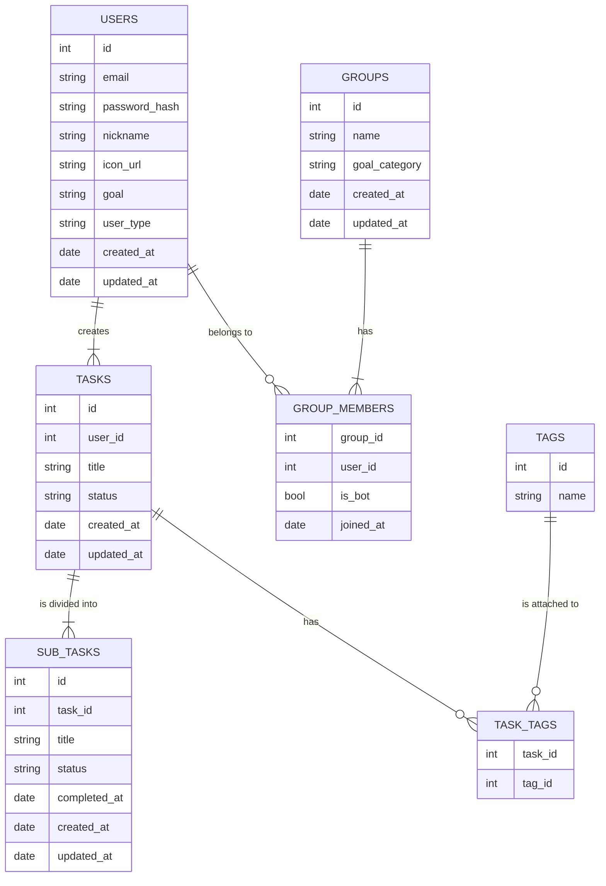

#### 各テーブルの概要

| テーブル名 | 概要 |
|------------|------|
| USERS | ユーザー情報を管理。 |
| TASKS | ユーザーが入力した大元のタスクを管理。 |
| SUB_TASKS | AIによって細分化された具体的なステップを管理。 |
| GROUPS | 共通の目標を持つユーザーが所属するグループ。 |
| GROUP_MEMBERS | ユーザーとグループの関連を管理する中間テーブル。AIボットもここで。 |
| TAGS / TASK_TAGS | タスクのカテゴリ分け用。達成記録の可視化などに利用。 |

#### 画面一覧
- サインアップ/ログイン画面
- オンボーディング画面 (初回利用時のプロフィール・目標設定)
- ホーム画面 (タスク管理)
- グループ画面
- マイページ画面 (達成記録)
- 設定画面

